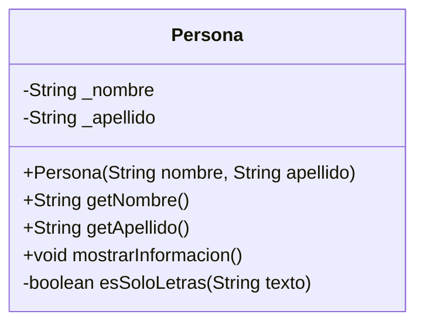
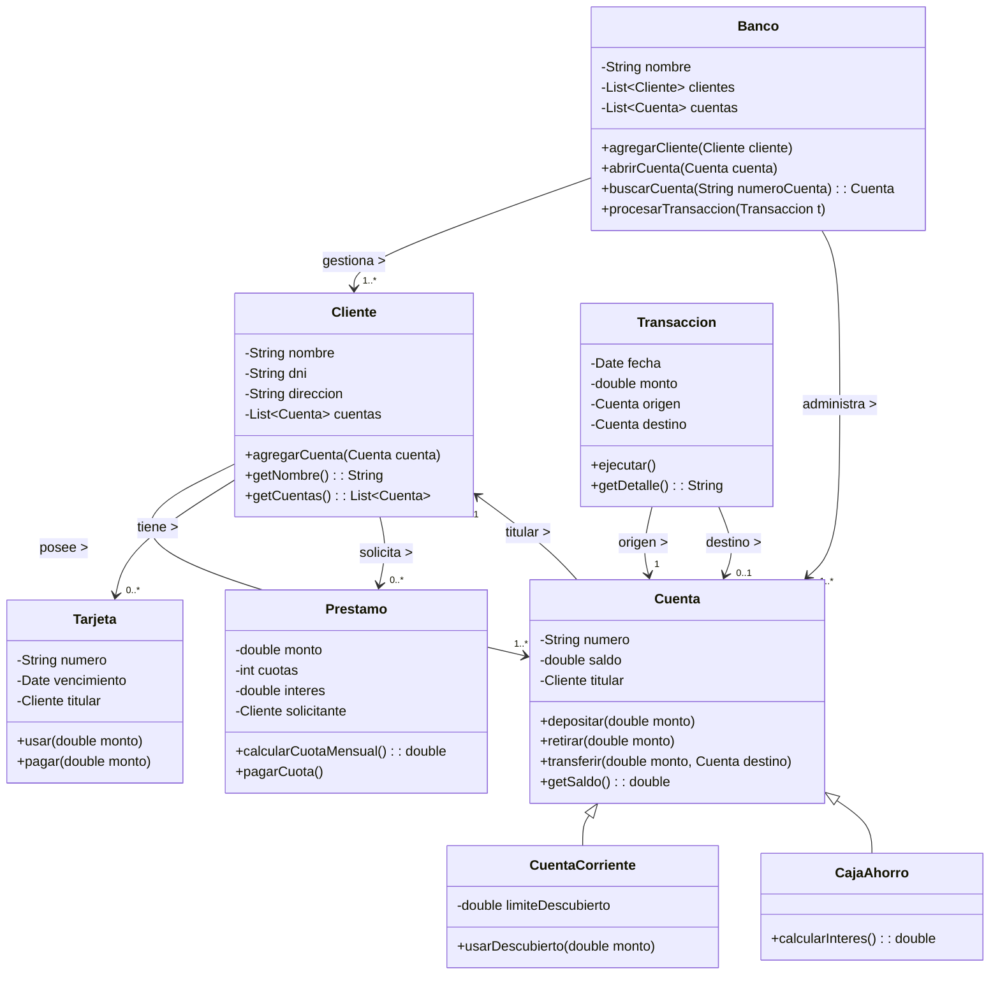
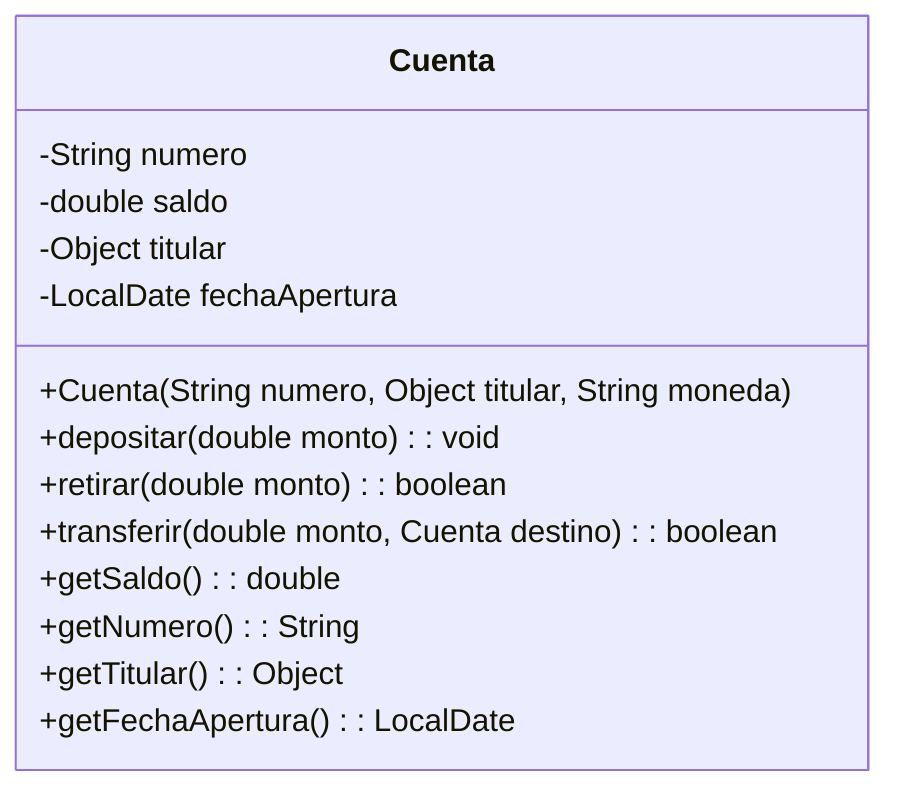

# Bienvenidos Digitallers 2025

## 23-09-2024 - Clase 35

### Pandas

Instalando la librerias
```cmd
pip install pandas
```

Importando libreria pandas
```python
import pandas as pd
```

Crear un dataframe )Como una tabla 2D)

```python
dataframe = pd.DataFrame({
    "Nombre" : ["Ana", "Luis", "Carlos"],
    "Edad" : [23, 34, 45],
    "Ciudad" : ["Madrid", "Barcelona", "Valencia"]
})
print(dataframe)
```

Metodos de exploracion rapida de pandas:
* head()
* tail()
* info()
* describe()


## 18-09-2024 - Clase 34

No se grabo!
Vimos APIS + Base de Datos Relacionales con SQLOTE

## 16-09-2025 - Clase 33

### Repaso de Machine Learning y APIS

No olvidar repasar el protocolo HTTP (y de paso dejar MG) : https://www.instagram.com/p/DMMcfavuN58/?img_index=1

- #### Programando nuestra API Localmente

Vamos a utilizar Flask que es una libreria para programar APIS rest
    
PAsos.
1. Creamos un entorno e instalamos la libreria flask
     
```cmd
python -m venv entrono
.\entrono\Scripts\activate
>pip install flask 
```
    
2. Nuestra primera API rest

```
from flask import Flask

print("Creando mi primera API REST con Flask " + __name__)
app = Flask(__name__)  ##Creo un objeto o instancia de Flas

@app.route("/")  ##Decorador que indica la ruta de acceso
def hola_mundo():
    return "Hola Mundo!"  ##Retorna un string

app.run(debug=True)  ##Ejecuta la aplicación en modo de depuración
```

3. Vamos a utilizar ahora el quetystring

```python
@app.route("/saludar")  ##Otra ruta de acceso
def saludar():
    nombre = request.args.get("nombre", "Desconcido")  ##Obtiene el parámetro 'nombre' de la URL, si no existe usa "Mundo"
    return "Hola " + nombre + "!"  ##Retorna un string
```

4. Instalar la extension de Chrome Rapidapi y probar a API con la extension

- ##### Programando una api de Personas

Vamos a tener los siguientes endpoints
* GET /personas  : Me devuelve una lista de personas con su id, nombre, apellido
* GET /personas/{id} : Me devuelve la informacion de una persona especifica
* POST /personas : Regustro una persona en el servidor

El codigo queda

```python
from flask import Flask, request, jsonify

print("Creando mi primera API REST con Flask " + __name__)
app = Flask(__name__)  ##Creo un objeto o instancia de Flas

personas = []

@app.route("/personas", methods=["GET"])  ##Otra ruta de acceso
def get_personas():
    return jsonify(personas)

##Obtengo persona por id
@app.route("/personas/<int:id>", methods=["GET"])
def get_persona(id):
    persona = next((p for p in personas if p["id"] == id), None)
    if persona:
        return jsonify(persona)
    return jsonify({"error": "Persona no encontrada"}), 404

@app.route("/personas", methods=["POST"])  ##Otra ruta de acceso
def add_persona():
    data = request.get_json()  ##Obtiene el JSON del cuerpo de la solicitud

    # Validar que tenga nombre y apellido
    if "nombre" not in data or "apellido" not in data:
        return jsonify({"error": "Falta nombre o apellido"}), 400  ##Retorna un error 400 (Solicitud incorrecta)

    nueva_persona = {
        "id": len(personas) + 1,
        "nombre": data["nombre"],
        "apellido": data["apellido"]
    }

    personas.append(nueva_persona)

    return jsonify(nueva_persona), 201  ##Retorna el JSON de la nueva persona y un código de estado 201 (Creado)

app.run(debug=True)  ##Ejecuta la aplicación en modo de depuración
```
- #### Programando nuestra API en Google Colab

Primero ingresar en ngrok
> https://ngrok.com/

Me interesa sacar el authgoken

En Google colab Hacemos
Primero instalamos las librerias
```python
!pip install flask
!pip install pyngrok
```

Luego ejecutamos...

```python
# Instalar pyngrok si no lo tenés


from flask import Flask, request, jsonify
from pyngrok import ngrok, conf

app = Flask(__name__)

auth_token = input("Ingrese su AuthToken de ngrok")
conf.get_default().auth_token = auth_token

# Levantar el túnel ngrok
public_url = ngrok.connect(5000)
print(" * ngrok tunnel URL:", public_url)

personas = []

@app.route("/personas", methods=["GET"])
def get_personas():
    return jsonify(personas)

@app.route("/personas/<int:id>", methods=["GET"])
def get_persona(id):
    persona = next((p for p in personas if p["id"] == id), None)
    if persona:
        return jsonify(persona)
    return jsonify({"error": "Persona no encontrada"}), 404

@app.route("/personas", methods=["POST"])
def add_persona():
    data = request.get_json()
    if "nombre" not in data or "apellido" not in data:
        return jsonify({"error": "Falta nombre o apellido"}), 400

    nueva_persona = {
        "id": len(personas) + 1,
        "nombre": data["nombre"],
        "apellido": data["apellido"]
    }
    personas.append(nueva_persona)
    return jsonify(nueva_persona), 201

# Ejecutar Flask
app.run(port=5000)

```

## 09-09-2025 - Clase 32

### Repaso machine Learning y Aplicaciones de escritorio

- #### Creacion de entornos en python

* Cuando hago pip install instalo las librerias para toda la maquina.
* Pero hay excenarios donde quiero generar un entorno separado con sus propias librerias
* Por ejemplo si no las quiero instalar para toda la maquina
* Si quiero instalar una version especifica de la libreria para ese proyecto
* Esto se llama crear un entorno asilado
* Generamente cuando te bajas un programa en python desde internet conviene probarlo en un entorno aislado
* Sino es un lio de liberias

Para crear un entorno aislado hacemos
```cmd
python -m venv venv
```
PAra activar y pararnos en el entorno
```cms
.\venv\Scripts\activate
```

En general para documentar que librerias necesita nuesto codigo se suele crear un archivo que se llama por convencion (aunque se puede llamar de cualquier manera) requirements.txt. Por ejemplo nuestro archivo va a tener

```txt
scikit-learn
```

Para instala los paquetes mencionados en ese archivo se hacer

```cmd
pip install -r requirements.txt
```

Para salir de un entorno utilizamos el comando

```cmd
deactivate
```

- ### Vamos a programar un evaluador de vinos

Resumen de Variables
* X = (MAYUSCULA) Una tabla con los datos de los features (alchol, fenoles, gusto, etc)
* y = (minuscula) Una tabla con los labels

```python
from sklearn.datasets import load_wine
from sklearn.preprocessing import StandardScaler #lleva los datos a una escala comun
from sklearn.model_selection import train_test_split
from sklearn.ensemble import RandomForestClassifier
import pandas as pd

print("Bienvenidos a mi evaluador de vinos")

dataset = load_wine()
#print(dataset.DESCR)
#print(dataset)
#print(dataset.feature_names)
#print(dataset.target_names)

#Esto para ver por pantalla los datos en formato tabla
##df = pd.DataFrame(data=dataset.data, columns=dataset.feature_names)
##df['target'] = dataset.target
#print(df.head())

X = dataset.data     # Features  - Los datos que hay aca son las caracteristicas de los vinos
y = dataset.target   # Labels  - Los datos que hay aca la calidad del vino

#Preproceso de datos
scaler = StandardScaler()
X = scaler.fit_transform(X)

X_train, X_text, y_train, y_test = train_test_split(X, y, test_size=0.1, random_state=42)

model = RandomForestClassifier()
model.fit(X_train, y_train)
accuracy = model.score(X_text, y_test)

print(f"El modelo tiene una precision de {accuracy*100:.2f}%")
```

- ### Vamos a agregar interfaz de Escritorio

```python
from sklearn.datasets import load_wine
from sklearn.preprocessing import StandardScaler #lleva los datos a una escala comun
from sklearn.model_selection import train_test_split
from sklearn.ensemble import RandomForestClassifier
import tkinter as tk
import pandas as pd

print("Bienvenidos a mi evaluador de vinos")

dataset = load_wine()
#print(dataset.DESCR)
#print(dataset)
#print(dataset.feature_names)
#print(dataset.target_names)

#Esto para ver por pantalla los datos en formato tabla
##df = pd.DataFrame(data=dataset.data, columns=dataset.feature_names)
##df['target'] = dataset.target
#print(df.head())

X = dataset.data     # Features  - Los datos que hay aca son las caracteristicas de los vinos
# Elijo alcoho
# Elijo alcohol, malic_acid, y color_intensity por nombre!
selected_features = ['proline', 'alcohol', 'color_intensity']
feature_indices = [dataset.feature_names.index(f) for f in selected_features]
X = dataset.data[:, feature_indices]


y = dataset.target   # Labels  - Los datos que hay aca la calidad del vino

#Preproceso de datos
scaler = StandardScaler()
X = scaler.fit_transform(X)

X_train, X_text, y_train, y_test = train_test_split(X, y, test_size=0.1, random_state=42)

model = RandomForestClassifier()
model.fit(X_train, y_train)
accuracy = model.score(X_text, y_test)

print(f"El modelo tiene una precision de {accuracy*100:.2f}%")

#Interfaz grafica

root = tk.Tk()
root.title("Evaluador de Vinos")

def evaluar_vino():
    # Obtener los valores de las entradas
    proline = float(entry_proline.get())
    alcohol = float(entry_alcohol.get())
    color_intensity = float(entry_color_intensity.get())

    # Preprocesar los datos
    X_new = scaler.transform([[proline, alcohol, color_intensity]])
    # Realizar la prediccion
    prediccion = model.predict(X_new)
    label_result.config(text=f"Predicción: {dataset.target_names[prediccion][0]}")

# Crear los elementos de la interfaz
label_proline = tk.Label(root, text="Proline:")
label_proline.pack()
entry_proline = tk.Entry(root)
entry_proline.pack()

label_alcohol = tk.Label(root, text="Alcohol:")
label_alcohol.pack()
entry_alcohol = tk.Entry(root)
entry_alcohol.pack()

label_color_intensity = tk.Label(root, text="Color Intensity:")
label_color_intensity.pack()
entry_color_intensity = tk.Entry(root)
entry_color_intensity.pack()

button_evaluar = tk.Button(root, text="Evaluar Vino", command=evaluar_vino)
button_evaluar.pack()

label_result = tk.Label(root, text="")
label_result.pack()

root.mainloop()
```

### Tarea

HACER LO MISMO PERO CON EL DATASET DE DIABETES
Para comenzar

```python
from sklearn.datasets import load_diabetes
#eSCALADOR
from sklearn.preprocessing import StandardScaler #lleva los datos a una escala comun

dataset = load_diabetes()
print(dataset.DESCR)
print(dataset.feature_names)
#print(dataset.target)

#Transforo el dataset.targer en valores entre 0 y 1 la probabilidad de diabetes
y = dataset.target
y = (y - y.min()) / (y.max() - y.min())
print(y)

##print(dataset.target)

```


---

## 09-09-2025 - Clase 31

### API : Aplication Program Interfaces

Caractacteristicas de la API rest
* Generamente consumen y devuelven JSON
* Las api Rest se consumen utilizando el protocolo HTTP
     * https://www.instagram.com/p/DMMcfavuN58/?img_index=1
     * Utilizamos las acciones HTTP para consumir una api REST
          * GET : Obtener Informacion      (En base de datos es un SELECT)
          * POST : Agregar informacion     (EN bd seria como un INSERT)
          * PUT : Actualizar informacion   (Seria en SQL como un UPDATE)
          * DELETE : Eliminar informacion  (En SQL es un...DELETE)
* Se pueden programar en python, javascript con nodejs, en cualquier lenguaje
* Las API permite comunicar Aplicaciones INDEPENDIENTEMENTE del lenguaje en el que fueron desarrolladas
* Podemos decir que el programador de BACKEND desarrolla las API y el programador de FRONTEND desarrolla la aplicacion en HTML y obtiene los datos por medio de esas API

Ejemplos de API conocidas
* Los ejemplos los podemos ver aca : https://www.instagram.com/p/ChF6pu8u6cm/?img_index=5
*  https://rickandmortyapi.com/
     *  Ejemplo: https://rickandmortyapi.com/api/character/
*  https://pokeapi.co/
     *  Ejemplo : https://pokeapi.co/api/v2/pokemon/
*  https://disneyapi.dev/
     *  Ejemplo : https://api.disneyapi.dev/character
*  https://spapi.dev/
     *  Ejemplor : https://spapi.dev/api/characters

- #### Generando nuestra primera api localmente

Para crear APIS desde python se utiliza la libreria flask que debemos instalar en la terminal con el siguiente comando:

```cmd
pip install flask
```
Para crear nuestra primera API en flask vamos a generar un archivo llamado hello-api.py con el siguiente contenido"

```python
from flask import Flask, jsonify, request

app = Flask("Mi primera APP con Flask")

@app.route('/hello')
def hello():
    return jsonify(message=f'Hola mundo desde Flask!')

app.run(debug=True)
```
Para ejecutarlo se hace
```
python hello-api.py
```
Y se accede al endopoint en nuestro navegador generalmente
```
http://127.0.0.1:5000/hello
```

Vamos a agregar otro metodo mas que maneje el querystring y reciba parametros
```python
@app.route('/saludar')
def saludar():
    #Para invocar este 
    nombre = request.args.get('nombre', 'Invitado')
    return jsonify(message=f'Hola, {nombre}!')
```

Vamos a agregar otro metodo mas que maneje el querystring y reciba parametros y sume...
```python
@app.route('/sumar')
def sumar():
    # Obtenemos los números de la URL, por ejemplo: /sumar?num1=5&num2=10
    num1 = request.args.get('num1', 0)
    num2 = request.args.get('num2', 0)
    
    try:
        # Convertimos a enteros
        suma = int(num1) + int(num2)
        return jsonify(result=suma)
    except ValueError:
        return jsonify(error="Por favor envía números válidos."), 400
```

Este se invoca por ejemplo
```
http://127.0.0.1:5000/sumar?num1=10&num2=20
```
---
## 04-09-2025 - Clase 30

### Vamos con Machine Learning    

1. Crearse un documento de Google Sheets Vacio

2. Cargar un dataset en el docunento. Vamos elegir uno de Kaggle : https://www.kaggle.com/

3. Abrir el Google Colab...
      * Este es el que estoy usando https://colab.research.google.com/drive/1hDz_rFrNUo4jHQVbRxkllxorit7epxog?usp=sharing

5. URL donde estan los datos del titac en CSV : https://raw.githubusercontent.com/datasciencedojo/datasets/master/titanic.csv

6. Cargar los datos a un dataset de Pandas

```python
import pandas as pd

titanic = pd.read_csv('https://raw.githubusercontent.com/datasciencedojo/datasets/master/titanic.csv')
titanic.head()
```
7. Determinar Features, Labels y Columnas que no Interesan

```python
conlumnas_que_no_interesan = ["PassengerId", "Name", "Ticket", "Cabin"]
features = ["Pclass","Sex","Age","SibSp","Parch","Fare", "Embarked"]
label = ["Survived"]
```

8. Verificar si no hay campos nulos en algun feature (no debe haber campos nulos en los features). Vamos a recorrer la lista de features y determinar cuales tienen filas con valores nulos


```python
## Recorrer la lista de features y determinar cuales features tienen valores nulos : Otto
for column in features:
    if titanic[column].isnull().any():
        print(f"La columna '{column}' tiene valores nulos.")

## La manera que habia pensado el profe
for column in features:
    if not titanic[titanic[column].isnull()].empty:
        print(f"La columna '{column}' tiene valores nulos.")

# La forma de Dario
for feature in features:
    nulos = titanic[titanic[feature].isna()]
    if nulos.shape[0] > 0:
        print(f"La columna '{feature}' tiene {nulos.shape[0]} valores nulos")
    else:
        print(f"La columna '{feature}' no tiene valores nulos")

##La forma de Juan Ignacio para contar cuantos nulos en cada columna
print(titanic.isnull().sum())
```

9. Eliminar las filas que tienen features en nulo (Age y embarked segun lo que vimos)

```python
titanic = titanic.dropna(subset=["Age", "Embarked"])
titanic.head()
```

10. Determinar un dataset para los features y otro para los labes
> En Machine learning se llama X (mayuscula) al dataset de los features e y (minuscula) al dataset de los labels

```python
#Determinamos dataset de featues y labes
X = titanic[features]  # En X se arma un dataset con las variables dependientes (features)
y = titanic[label]     # En y se  un dataset con las variables independietes (labes )
```

11. La columna Sex y la columna Embarked no son numeros. Los algoritmos de Machine Learning trabajan mejor con datos numericos

```python
from sklearn.preprocessing import LabelEncoder

#...

encoder = LabelEncoder()
titanic["Sex"] = encoder.fit_transform(titanic["Sex"])
titanic["Embarked"] = encoder.fit_transform(titanic["Embarked"])
```

12. Separamos los datos de prueba y entrenamiento. Para hacerlo vamos a utilizar la siguiente convencion de nombres
     * X_train
     * X_test
     * y_train
     * y_tes

```python
from sklearn.model_selection import train_test_split

#...

X_train, X_test, y_train, y_test = train_test_split(X, y, test_size=0.3, random_state=42)
```

13. Entrenar el modelo con los datos de entrenamiento (X_train e y_train)\\

```python
from sklearn.ensemble import RandomForestClassifier

model = RandomForestClassifier(n_estimators=100, random_state=42)
model.fit(X_train, y_train)
```

14. Evaluar el modelo. Se crea la variable y_ped donde se guarda la prediccion del modelo

```python
from sklearn.metrics import accuracy_score, classification_report

#Evaluar el modelo
y_pred = model.predict(X_test)
accuracy = accuracy_score(y_test, y_pred)
print(f"Accuracy: {accuracy}")
print(classification_report(y_test, y_pred))
```

15. Dio accuracy 0.77. Medio malardo. Probemos con otro algoritmo

```python
from sklearn.ensemble import GradientBoostingClassifier

model = GradientBoostingClassifier(n_estimators=100, learning_rate=0.1, random_state=42)
model.fit(X_train, y_train)

```
16. 

### Aprendiendo  usar Pandas

**Cargar un DataSet desde un CSV**
```python
import pandas as pd

titanic = pd.read_csv('https://raw.githubusercontent.com/datasciencedojo/datasets/master/titanic.csv')
```

**Mostrar las primeras filas de un DataSet**
```python
dataset.head()
```

**Seleccionar Datos de un Dataset**     
EJ : Como seria en pandas "select Name, Age, Sex from titanic"
```python
select = titanic[["Name", "Age", "Sex"]]
select.head()
```

**Seleccionar las filas donde Un campo sea nulo**     
Ej : Select * from titanic where age is null
```python
nulos_age = titanic[titanic["Age"].isnull()]
nulos_age.head()
```

**Saber si un dataset tiene esta vacio**
```python
dataset.empty
```

**Saber la cantidad de elementos en un dataset**
```
print(len(titanic))
print("-----")
print(titanic.count()) ##Aca se ven los campos nulos
print("-----")
print(titanic.shape) ##Devuelve una tupla (caantidad_registro, cantidad_columnas)
```

**Borrar columnas que tienen campos nulos**     
Ej Delete from titatic where age is null or embarked is null
```python
titanic = titanic.dropna(subset=["Age", "Embarked"])
titanic.head()
```

### Aprendiendo  usar Scikit-Learn (sklerarn)

**Convertir una columna no numerica en una columna numerica**

```python
encoder = LabelEncoder()
titanic["Sex"] = encoder.fit_transform(titanic["Sex"])
titanic["Embarked"] = encoder.fit_transform(titanic["Embarked"])
```

## 02-09-2025 - Clase 29

> **Clase de habilidades Blandas**

## 28-08-2025 - Clase 28

### Novedades de IA

- #### Modelo Nano Banana
  
Vamos a probar el modelo de generacion de imagenes de google "Nano Banana"
Simplemente vamos a gemini
> https://gemini.google.com/app
> https://aistudio.google.com/
Ver review en:
> https://www.youtube.com/watch?v=-gPL9EA2pP8

- #### Vamos a Generar desde python

1. Sacar una api key de google de aca : https://aistudio.google.com/apikey
2. Documentacion para generar Imagenes con Gemini : https://ai.google.dev/gemini-api/docs/image-generation?utm_source=AISgaias&utm_medium=email&utm_campaign=nano&utm_content=hero_start_building&hl=es-419
3. GRRRRRR no salio del todo

### Machine Learning

Ver Introduccion en : https://www.instagram.com/p/C1ntRrRswAu/?img_index=1

Empecemos por unos juegos
```
Juego
X = [[1],[2],[3]]
y=[2,4,6]
Si me dan el 4 se que la salida es 8....
```

```
Juego
X=[[1],[2],[3]]
y=[7,9,11] 
Si medan el 4 la salida es...13
```

- #### Ejemplos de aplicacion de Machine Learning

Pensemos en Datos, bases de datos, campos... no tanto en imagenes, ni en texto....que es a lo que nos vamos a orientar en Machine Learning

**Clasificacion**
* Le paso los datos de un cliente (ubicacion, edad, trabajo, etc..) me dice si es un potecial comprador o no
* Clasificacion de imagenes suele relacionarse mas con lo que es Computer Vision. 
* Clasificacion de productos para ver cuales tienen mas potencial de ventas
* Clasificar para predecir si un cliente de un banco es un petencial deudor a ver si le damos un prestamo
* Segementacion de clientes para marketing
* Se utiliza mucho en los algoritmos de recomedacion de youtube, instagram, amazon, ...etc <<<

**Regresion**
* Estan relacionados con predecir un valor en una serie temporal a partir de cieras variables
* Predecir el valor de una accion a futuro
* Predecir cuanto tiempo va a pasar un usuario en una red socual
* Predecir la eficiencia de combustible de un automóvil en el tiempo
* Predecir el precio de una casa de acuerdo a metros cuadrados , números de habitaciones, etc

**Deteccion de anomalias**
* Detectar transacciones fraudulentas en un banco
* Fraude con tarjetas de credigo
* Detectar valores fuera de rango en sensores
* Deteccion de intrusiones en la red

- #### Algoritmos de Machine Learning

* **Regresion Lineal** : algoritmo de machine learning supervisado que aprende a predecir un valor numérico continuo a partir de una o más variables independientes, ajustando una línea (o plano) que minimiza la diferencia entre las predicciones y los valores reales.

- #### Machine Learning en Python

Librerias que debemos conocer : https://www.instagram.com/p/C_VyOHHRv0N/?img_index=1

**Numpy**
Para manejo de listas (arrays) de forma mas eficiente que python nativo
```python
#Ejemplo numpy
import numpy as np

X = np.array([[1, 2, 3], [4, 5, 6]])
print(X)

#En vez de hacer
X = [[1, 2, 3], [4, 5, 6]]
print(X)
```

**Pandas**
Libreria para analisis de datos. Permite creaar DataFrames que lo podes pensar como una tabla de una base datos en memoria
```python
import pandas as pd

df = pd.DataFrame({
    'nombre': ['Juan', 'María', 'Pedro', 'Ana', 'Luis'],
    'edad': [25, 30, 35, 40, 45], 
})

print(df)
```
**MatplotLib**para aplicaciones visuales y visualizacion de graficos en colab
```python
import matplotlib.pyplot as plt 
import pandas as pd

df = pd.DataFrame({
    "mes" : ["Enero", "Febrero", "Marzo", "Abril"],
    "ventas" : [100, 200, 300, 400]
});

df.plot(x="mes", y="ventas", kind="bar")
plt.show()
```
**Scikit learn** Que es na libreria para aprender Machine Learning pero que es tan buena que no solo se usa para aprender sino que tambien se termino usando para entrenar modelos productivos de machine learning
```python
from sklearn.linear_model import LinearRegression

X = [[1],[2],[3]]   #Features o caracteristicas O entrada o variables independientes
y = [2,4,6]         #Labels o etiqutas o salidas o variables dependientes

model = LinearRegression()
model.fit(X,y)      

print(model.predict([[4]]))
```

**Streamlit (BONUS)** para aplicaciones visuales y visualizacion de graficos (en mi pc) (Esta no funciona en colab, es mas para ejecutarlo en mi pc). Es una mezcla de matplotlib y gracio
Primero instalarla
```
pip install streamlit
```
Luego el codigo
```
import streamlit as st
import pandas as pd

df = pd.DataFrame({
    "mes" : ["Enero", "Febrero", "Marzo", "Abril"],
    "ventas" : [100, 200, 300, 400]
});

st.line_chart(df.set_index("mes"))
```
luego lo ejecutamos desde la terminal con
```
streamlit run streamlit-demo.py
```


---

## 26-08-2025 - Clase 27

- ### Clase de habilidades blandas
  
---

## 19-08-2025- Clase 25

### SQL Interactivo con Gradio

Colab : https://colab.research.google.com/drive/1so1DyznL9gsnqEvNWQcC3wtcRH7RfWQP?usp=sharing
Chat con ChatGPT  : https://chatgpt.com/share/68a4fe7c-3b00-8005-8420-e471432c7146

- #### Base de datos usada y Datos usados

```python
sql_creacion_base = """
    -- Crear tabla Categorías
    CREATE TABLE Categorias (
        id_categoria INTEGER PRIMARY KEY AUTOINCREMENT,
        nombre TEXT NOT NULL,
        descripcion TEXT
    );

    -- Crear tabla Productos
    CREATE TABLE Productos (
        id_producto INTEGER PRIMARY KEY AUTOINCREMENT,
        nombre TEXT NOT NULL,
        precio REAL NOT NULL,
        stock INTEGER NOT NULL,
        id_categoria INTEGER,
        FOREIGN KEY (id_categoria) REFERENCES Categorias(id_categoria)
    );

    -- Crear tabla Clientes
    CREATE TABLE Clientes (
        id_cliente INTEGER PRIMARY KEY AUTOINCREMENT,
        nombre TEXT NOT NULL,
        email TEXT UNIQUE,
        telefono TEXT
    );

    -- Crear tabla Ventas
    CREATE TABLE Ventas (
        id_venta INTEGER PRIMARY KEY AUTOINCREMENT,
        id_cliente INTEGER,
        fecha TEXT NOT NULL,
        total REAL NOT NULL,
        FOREIGN KEY (id_cliente) REFERENCES Clientes(id_cliente)
    );

    -- Crear tabla DetalleVenta
    CREATE TABLE DetalleVenta (
        id_detalle INTEGER PRIMARY KEY AUTOINCREMENT,
        id_venta INTEGER NOT NULL,
        id_producto INTEGER NOT NULL,
        cantidad INTEGER NOT NULL,
        subtotal REAL NOT NULL,
        FOREIGN KEY (id_venta) REFERENCES Ventas(id_venta),
        FOREIGN KEY (id_producto) REFERENCES Productos(id_producto)
    );
"""
```

datos

```python
sql_datos_base = """
  -- Insertar categorías
  INSERT INTO Categorias (nombre, descripcion) VALUES
  ('Bebidas', 'Bebidas alcohólicas y no alcohólicas'),
  ('Lácteos', 'Leche, queso, yogur y derivados'),
  ('Frutas y Verduras', 'Productos frescos'),
  ('Panadería', 'Pan, facturas y repostería'),
  ('Limpieza', 'Productos de limpieza y hogar');

  -- Insertar productos
  INSERT INTO Productos (nombre, precio, stock, id_categoria) VALUES
  ('Coca Cola 500ml', 120.5, 50, 1),
  ('Leche Entera 1L', 150.0, 30, 2),
  ('Queso Mozzarella 200g', 200.0, 20, 2),
  ('Manzana Roja', 80.0, 100, 3),
  ('Pan Integral', 50.0, 40, 4),
  ('Detergente Líquido 1L', 250.0, 25, 5);

  -- Insertar clientes
  INSERT INTO Clientes (nombre, email, telefono) VALUES
  ('Juan Pérez', 'juan.perez@email.com', '123456789'),
  ('María Gómez', 'maria.gomez@email.com', '987654321'),
  ('Carlos López', 'carlos.lopez@email.com', '555666777');

  -- Insertar ventas
  INSERT INTO Ventas (id_cliente, fecha, total) VALUES
  (1, '2025-08-19', 370.5),
  (2, '2025-08-18', 430.0);

  -- Insertar detalles de venta
  INSERT INTO DetalleVenta (id_venta, id_producto, cantidad, subtotal) VALUES
  (1, 1, 2, 241.0),
  (1, 5, 1, 50.0),
  (1, 4, 1, 79.5),
  (2, 2, 2, 300.0),
  (2, 3, 1, 200.0),
  (2, 6, 1, 250.0);

"""
```

- #### Relaciones Maestro detalles en SQL

```sql
SELECT 
    v.id_venta AS NroFactura,
    v.fecha,
    c.nombre AS Cliente,
    p.nombre AS Producto,
    dv.cantidad,
    dv.subtotal,
    v.total AS TotalFactura
FROM Ventas v
JOIN Clientes c ON v.id_cliente = c.id_cliente
JOIN DetalleVenta dv ON v.id_venta = dv.id_venta
JOIN Productos p ON dv.id_producto = p.id_producto
ORDER BY v.id_venta;
```

- #### Repasando funciones de Agregacion

Eran:
* COUNT()
* MAX()
* MIN()
* SUM()
* AVG()

Ejemplos:

Quiero el total de las ventas:
```sql
SELECT SUM(total) AS TotalVentas FROM Ventas;
```

Quiero el promedio de las ventas
```sql
SELECT
    AVG(total) AS PromedioVentas
FROM Ventas;
```

Quiero el total de las ventas por cliente (agrupadas por cliente):
```sql
SELECT
    c.nombre AS Cliente,
    SUM(v.total) AS TotalVentas
FROM Ventas v
JOIN Clientes c ON v.id_cliente = c.id_cliente
GROUP BY c.nombre;
```

Quiero el total de las ventas por cliente que gastaron mas de 400 (agrupadas por cliente):
```sql
SELECT
    c.nombre AS Cliente,
    SUM(v.total) AS TotalVentas
FROM Ventas v
JOIN Clientes c ON v.id_cliente = c.id_cliente
GROUP BY c.nombre
HAVING SUM(v.total) > 400;
```

Quiero el total de ventas por producto
```sql
SELECT
    p.nombre AS Producto,
    SUM(dv.subtotal) AS TotalVentas
FROM DetalleVenta dv
JOIN Productos p ON dv.id_producto = p.id_producto
GROUP BY p.nombre
ORDER BY TotalVentas DESC;
```

Aparte : Los productos que no se vendieron
```sql
SELECT p.id_producto, p.nombre
FROM Productos p
LEFT JOIN DetalleVenta dv ON p.id_producto = dv.id_producto
WHERE dv.id_producto IS NULL;
```
Con un not exits y subconsulta
```sql
SELECT
    p.nombre AS ProductoNoVendido
FROM Productos p
WHERE NOT EXISTS (
    SELECT 1
    FROM DetalleVenta dv
    WHERE dv.id_producto = p.id_producto
);
```

Los Clientes que no realizaron ninguna compra
```sql
SELECT
    id_cliente,
    nombre,
FROM Clientes c
WHERE NOT EXISTS (
    SELECT "Resultado"
    FROM Ventas v
    WHERE v.id_cliente = c.id_cliente
);
```

- #### Ejemplo de LEFT JOIN

```sql
SELECT
    *
FROM Clientes c
LEFT JOIN Ventas v ON c.id_cliente = v.id_cliente
```

Da como resultado por ejemplo     

id_cliente	nombre	email	telefono	id_venta	id_cliente	fecha	total
1	Juan Pérez	juan.perez@email.com	123456789	1	1	2025-08-19	370.5
2	María Gómez	maria.gomez@email.com	987654321	2	2	2025-08-18	430.0
3	Carlos López	carlos.lopez@email.com	555666777	None	None	None	None


- #### Manejo de Nulos

* SELECT 1=1 >>> Da Verdadero
* SELECT 1=2 >>> Da Falso
* SELECT NULL=NULL >> Da Falso / Error / None (NO SE PUEDEN COMPARAR NULOS ENTRE SI)
* SELECT NULL IS NULL >>> Ahora si True

TIP
* Tratar que los campos de la base de datos no admitan nulos como buena practica
* Las comparaciones de nulos son anti intuitivas

## 14-08-2025- Clase 24

### Recursos para Aprender SQL

* https://www.db-fiddle.com/ - Para probar SQL sin instalar nada localmente
* https://mystery.knightlab.com/ - SQL Murder Mystery
* https://sqlbolt.com/ - Tutorial de SQL

### Sintaxis SQL

- #### CREATE TABLE

Para crear una tabla la sitazzzzzis es esta:
```
  CREATE TABLE <NOMBRE_TABLA>
  (
      <NOMBRE_CAMPO> <TIPO_DE_DATO> <MODIFICADORES>,
      <NOMBRE_CAMPO> <TIPO_DE_DATO> <MODIFICADORES>,
      ...
      [
         FOREIGN KEY <NOMBRE_CAMPO> REFERENCES <NOMBRE_TABLA>(<NOMBRE_CAMPO>) (ON DELETE CASCADE)
      ]
  )

<TIPO_DE DATO> : Varia segun el motor de base de datos
<MODIFICADORES> : Algunos puden ser bastante Comunues como NOT NULL, pero cada motor puede tener sus modificadores propios
```
Modificadores Comunes
* NOT NULL
* PRIMARY KEY
* UNIQUE

 - #### SELECT

**WHERE**
```ejemplo
SELECT documento, apellido
FROM personas
WHERE altura_cm > 170
```

**Funciones de Agregacion**
* SUM
* COUNT
* AVG
* MAX
     
**Consultas singleton**
Devuelven un solo valor (un campo solo y un registro solo)
```sql
(SELECT AVG(altura_cm) FROM personas);
```
    
**Subconsultas**
```sql
SELECT nombre, altura_cm
FROM personas
WHERE altura_cm > (SELECT AVG(altura_cm) FROM personas);
```
    
**NOT IN**
```sql
/*El nombre de las personas cuyo apellido no sea 
ni PEREZ, Ni GOMEZ, ni FERNANDEZ*/
SELECT nombre, apellido
FROM personas
WHERE apellido NOT IN ('Pérez', 'Gómez', 'Fernández');
```
     
**NOT EXISTS**
SELECT nombre, apellido, altura_cm AS altura
FROM personas p1
WHERE NOT EXISTS (
    SELECT 1
    FROM personas p2
    WHERE p2.altura_cm > p1.altura_cm
);

**Joins**
    
```sql
SELECT 
    CONCAT(p.nombre, ' ', p.apellido) AS nombre_completo,
    d.calle,
    d.altura
FROM 
    personas p
LEFT JOIN 
    domicilio d ON p.id = d.persona_id;
```

Que es lo mismo que escribir

```sql
SELECT 
    CONCAT(p.nombre, ' ', p.apellido) AS nombre_completo,
    d.calle,
    d.altura
FROM 
    personas p,
    domicilio d
WHERE
    p.id = d.persona_id;
```

- #### UPDATE

```sql
UPDATE Products SET Price = 1500.00 WHERE ProductName = 'Laptop';
```
o
```sql
UPDATE Products SET Price = Price * 1.10;
```

- #### DELETE

DELETE FROM Users WHERE ID = 5;

Que pasa si pongo DELETE FROM TABLA SIN UN WHERE>>>> BORRA TODA LA TABLA

### Juego de buscar el asesino

TAREA : Para la proxima clase les dejo la investigacion en sus manos y vemos quien lo resuelve
Hasta ahora

```
Security footage shows that there were 2 witnesses. The first witness lives at the last house on "Northwestern Dr". The second witness, named Annabel, lives somewhere on "Franklin Ave".


Hay que encontrar esos 2 testigos para luego consultar la table Interview

/*Quiero las personas que viven en Northwestern Dr*/

SELECT person_id, name, address_street_name, address_number
FROM person
WHERE address_street_name = 'Northwestern Dr'
ORDER BY address_number DESC

SELECT person_id, name, address_street_name
FROM person
WHERE name LIKE 'Annabel%'
  AND address_street_name = 'Franklin Ave';


14887	Morty Schapiro	Northwestern Dr	4919  (1er testigo)
16371	Annabel Miller	Franklin Ave

---
SELECT *
FROM interview
WHERE person_id IN (14887, 16371);

-----
person_id	transcript
14887	I heard a gunshot and then saw a man run out. He had a "Get Fit Now Gym" bag. The membership number on the bag started with "48Z". Only gold members have those bags. The man got into a car with a plate that included "H42W".
16371	I saw the murder happen, and I recognized the killer from my gym when I was working out last week on January the 9th.

Ahora hay que ir a la tabla get_fit_now_member
```

### ChatGPT para aprender Base de Datos
Prompt 
> Quiero que actúes como un terminal SQL frente a una base de datos de ejemplo. La base de datos contiene tablas llamadas "Products", "Users", "Orders" y "Suppliers". Escribiré consultas y tú responderás con lo que el terminal mostraría. Quiero que respondas con una tabla de resultados de la consulta en un solo bloque de código, y nada más. No escribas explicaciones. No escribas comandos a menos que te lo indique. Cuando necesite decirte algo en inglés, lo haré entre llaves {así}.

---
---
## 12-08-2025- Clase 23

### Bases de Datos

Motores de Bases datos (Relacionales) Conocidos
* MySQL (https://www.mysql.com/)
* Postgres (https://www.postgresql.org/)
* MariaDB (https://mariadb.org/)
* SQLite (https://sqlite.org/) <<  **Este es el que vamos a utilizar nosotros para aprender**
* Oracle (https://www.oracle.com/database/) - Se usa mucho a nivel Empresarial
* SQL Server (https://www.microsoft.com/es-es/sql-server/sql-server-downloads) - Se usa mucho a nivel Empresarial

---

### SQL (Standard Query Language)

- #### SQL : DDL (Data Definition Language)

Creamos tabla

```sql
CREATE TABLE Personas(
    id INTEGER PRIMARY KEY,
    nombre TEXT NOT NULL UNIQUE
);
```
    
En SQLIte para ver las tablas de mi base de datos puedo usar el comando
    
```sqlite
.tables
```

- #### SQL : DML (Data Manipulation Language)

Agregar y modificar los datos de las tablas

```sql
INSERT INTO Personas (id, nombre) VALUES (1, 'Juan');
INSERT INTO Personas (id, nombre) VALUES (2, 'Pedro');

```    

- #### SQL : DQL (Data Query Laguage)

Consultar los datos de las tablas

```sql
SELECT * FROM Personas
```

---

### SQLite

Pasos
1. Descargar SQLite y tools (https://sqlite.org/download.html)
2. En la carpeta donde descomprimimos los archivos ejecutamos
    
```cmd
sqlite3
(para salir ctrl+c)
```
    
3. Los comandos terminan con ; (punto y coma)
4. Tiene un Browser visual para windows : https://sqlitebrowser.org/

#### Ejercicio SQLite

> Crear una tabla alumnos con nombre y apellido, luego ingresar 3 alumnos y luego consultar la tabla

```sql
CREATE TABLE alumnos (
    id INTEGER PRIMARY KEY AUTOINCREMENT,
    nombre TEXT NOT NULL,
    apellido TEXT NOT NULL
);

INSERT INTO alumnos (nombre, apellido) VALUES ('Juan', 'Pérez');
INSERT INTO alumnos (nombre, apellido) VALUES ('María', 'García');
INSERT INTO alumnos (nombre, apellido) VALUES ('Carlos', 'López');

SELECT * FROM alumnos;
```

#### SQLITE desde python

Leer base sqlite desde python
> Tengo la base de datos alumnos.db en sqlite y quiero un programa en python que haga un select sobre la tabla alumnos y muestre todo por pantalla
    
```import sqlite3

# Conectar a la base de datos
conexion = sqlite3.connect('alumnos.db')

# Crear un cursor para ejecutar consultas
cursor = conexion.cursor()

# Ejecutar la consulta SELECT
cursor.execute("SELECT * FROM alumnos")

# Obtener todos los resultados
filas = cursor.fetchall()

# Mostrar los resultados
for fila in filas:
    print(fila)

# Cerrar la conexión
conexion.close()

```

Para escribir datos desde python

```python
##Que me pregunte el nomre y el apellido y lo guarde en la tabla alumnos
import sqlite3

# Connect to SQLite database. It will be created if it doesn't exist.
conn = sqlite3.connect('alumnos.db')

# Ask for user input
nombre = input("Please enter your name: ")
apellido = input("Please enter your last name: ")
# Save to database
cur = conn.cursor()
cur.execute('INSERT INTO alumnos (nombre, apellido) VALUES (?, ?)', (nombre, apellido))
conn.commit()
print(f"Alumno {nombre} {apellido} saved successfully.")

# Close the connection
conn.close()

```

----
## 07-08-2025- Clase 22

- ### Funcionamiento y Arquitectura Transformers para los LLM

> https://bbycroft.net/llm

- ### Objetos con Javascript

Ejemplo Automovil
```javascript
<!DOCTYPE html>
<html lang="en">

<head>
    <meta charset="UTF-8">
    <meta name="viewport" content="width=device-width, initial-scale=1.0">
    <title>Ejemplo Objeto Automóvil</title>
    <link rel="stylesheet" href="02-JS-Objetos-Automovil.css">

    <script>
        //Crear una clase automovil con encapsulamiento que tenga
        //velocidad, distanciaRecorrida, acelerar, frenar, actualizarDistancia (que recibe un tiempo)

        class Automovil {
            #velocidad;
            #distanciaRecorrida;
            constructor() {
                this.#velocidad = 0;
                this.#distanciaRecorrida = 0;
            }
            acelerar(valor) {
                if (valor > 0) {
                    this.#velocidad += valor;
                }
            }
            frenar(valor) {
                if (valor > 0) {
                    this.#velocidad = Math.max(0, this.#velocidad - valor);
                }
            }
            actualizarDistancia(tiempo) {
                if (tiempo > 0) {
                    this.#distanciaRecorrida += this.#velocidad * tiempo;
                }
            }

            get velocidad() {
                return this.#velocidad;
            }

            get distanciaRecorrida() {
                return this.#distanciaRecorrida;
            }
        }
    </script>

    <script>
        //Crear un objeto automovil que va a ser de mi pagina
        const miAutomovil = new Automovil();
    </script>
</head>

<body>
    <!--Mostrar los datos del automovil-->
    <!--Agregar un boton para acelerar y otro para frenar-->
    <div id="auto">
        <h2>Datos del Automóvil</h2>
        <p><strong>Velocidad:</strong> <span id="velocidadAuto">0</span> km/h</p>
        <p><strong>Distancia recorrida:</strong> <span id="distanciaAuto">0</span> km</p>

        <button id="btnAcelerar">Acelerar</button>
        <button id="btnFrenar">Frenar</button>
    </div>

    <script>
        //La funcion que muestre los datos del automovil en el div   
        function mostrarAuto(auto) {
            document.getElementById('velocidadAuto').textContent = auto.velocidad;
            document.getElementById('distanciaAuto').textContent = auto.distanciaRecorrida.toFixed(2);
        }

        //Vincular los botones con las acciones del automovil
        document.getElementById('btnAcelerar').addEventListener('click', () => {
            miAutomovil.acelerar(10); // Acelera en 10 km/h
            mostrarAuto(miAutomovil);
        });

        document.getElementById('btnFrenar').addEventListener('click', () => {
            miAutomovil.frenar(10); // Frena en 10 km/h
            mostrarAuto(miAutomovil);
        });

        //Crear un intervalo para actualizar la distancia por el automovil cada segundo
        setInterval(function () {
            miAutomovil.actualizarDistancia(1 / 3600); // actualiza distancia por 1 segundo (1/3600 horas)
            mostrarAuto(miAutomovil);
        }, 1000);
    </script>

</body>

</html>
```

- ### Componentes

> Definicion : Un compoHnente es un objeto que tiene una representacion visual (es decir, que sabe mostrarse)

Hay librerias y framework que programan web utilizando componentes:
* React
* Angular
* Vue
Y tambien estan como parte del estandar de html5
* webcomponents

- ### Webcomponents

Implementacion estadar de componentes en html

```javascript
        class GamePersonaje extends HTMLElement {
            #nombre;
            #vida;

            static get observedAttributes() {
                return ['nombre', 'vida'];
            }

            constructor() {
                super();
                this.attachShadow({ mode: 'open' });
                this.#nombre = this.getAttribute('nombre') || 'Sin nombre';
                this.#vida = parseInt(this.getAttribute('vida')) || 100;
            }

            attributeChangedCallback(name, oldValue, newValue) {
                if (name === 'nombre') this.#nombre = newValue;
                if (name === 'vida') this.#vida = Math.max(0, parseInt(newValue));
                this.render();
            }

            atacar(objetivo, danio = 10) {
                if (!(objetivo instanceof GamePersonaje)) return;
                if (!this.estaVivo() || !objetivo.estaVivo()) return;
                objetivo.recibirDanio(danio);
            }

            recibirDanio(cantidad) {
                if (!this.estaVivo()) return;
                this.#vida = Math.max(0, this.#vida - cantidad);
                this.setAttribute('vida', this.#vida);
            }

            estaVivo() {
                return this.#vida > 0;
            }

            render() {
                const vidaMax = 100;
                const vidaPorcentaje = Math.max(0, (this.#vida / vidaMax) * 100);
                const colorVida = vidaPorcentaje > 60 ? '#4caf50' : vidaPorcentaje > 30 ? '#ff9800' : '#f44336';

                this.shadowRoot.innerHTML = `
                    <style>
                        .card {
                            border: 2px solid #333;
                            border-radius: 12px;
                            padding: 16px;
                            max-width: 250px;
                            background: linear-gradient(145deg, #1e1e1e, #2c2c2c);
                            color: white;
                            font-family: Arial, sans-serif;
                            box-shadow: 0 4px 10px rgba(0,0,0,0.4);
                            transition: transform 0.3s;
                        }
                        .card:hover { transform: scale(1.05); }
                        .vida-bar {
                            background-color: #444;
                            border-radius: 8px;
                            overflow: hidden;
                            height: 20px;
                            margin-bottom: 8px;
                        }
                        .vida-fill {
                            height: 100%;
                            width: ${vidaPorcentaje}%;
                            background-color: ${colorVida};
                            transition: width 0.4s ease-in-out, background-color 0.3s;
                        }
                        h3 {
                            margin: 0 0 8px;
                            text-align: center;
                            font-size: 1.4em;
                            color: #ffcc00;
                        }
                        p { margin: 4px 0; }
                    </style>
                    <div class="card">
                        <h3>${this.#nombre}</h3>
                        <div class="vida-bar">
                            <div class="vida-fill"></div>
                        </div>
                        <p>❤️ Vida: ${this.#vida}</p>
                        <p style="font-weight: bold; color: ${this.estaVivo() ? '#4caf50' : '#f44336'};">
                            ${this.estaVivo() ? '🟢 Vivo' : '💀 Muerto'}
                        </p>
                    </div>
                `;
            }

            connectedCallback() {
                this.render();
            }
        }

        customElements.define('game-personaje', GamePersonaje);
```


## 05-08-2025- Clase 21

- ### Javascript

#### DOM (Document Objet Model)

Libreria de javascript que me permite interactuar con la pagina actual

Objetos y metodos:
     
* document : Representa el documento o pagina actual
      * getDocumentById(id) : Devuelve como objeto de javascript un elemento de la pagina especificado como ID
      * createElement : Para crear un elemento html en memoria
      * appendChild(elemento) para agregar ese elemento a un padre
* HtmlElement
        *  addEventListener : Vincular una funcion que se ejecuta ante un evento
        *  textContent : Setear por javascript el contenido de texto de un elemento
        *  innertHTML :  Setear por javascript el contenido html de un elemento

Funciones Estandar Javascript
* alert es un metodo que muestra un mensaje por pantalla
* parseInt :  Lo convierte de un string a un entero
* parseFloat : Lo convierte de un string a un numero con coma
  
## 31-07-2025- Clase 20

- ### HTML

Decimos html peeeero... las paginas web tienen todas html+css+javascript

Herramientas de un desarrollador:
* F12 : Chrome Develepoer Tools
* Ctrl+u : Para ver el codigo fuente de la pagina
* La extension Live Server para levandar un servidor de HTTP local
* Visual Studio Code
* Usar el port forwarding desde la parte de la terminal para poder compartir un puerto y que se pueda acceders desde Internet

Nuestro "Hola Mundo" en html

```html
    <!DOCTYPE html>
    <html lang="es">
    <head>
        <meta charset="UTF-8">
        <meta name="viewport" content="width=device-width, initial-scale=1.0">
        <title>Document</title>
        <style>
            .titulo {
                margin: 0;
                height: 100vh;
                display: flex;
                align-items: center;
                justify-content: center;
                color: blue;
            }
        </style>
    </head>
    <body>
        <h1 class="titulo">Hola, este es un documento HTML de ejemplo.</h1>
    </body>
    </html>
```

HTML TIP : USAR LA IA PARA GENERAR HTML

- ### HTTP
LAs paginas html se sirven utilizando el protocollo http
> https://www.instagram.com/p/DMMcfavuN58/?img_index=1

## 29-07-2025- Clase 19

### Programacion orientada a objetos

Un objeto es consistente cuando el valor de sus atributos tiene sentido el mundo real
Un objeto es inconsistente cuando el valor de sus atributos no tiene sentido ej
El valor de los atributos posibles de un objeto lo definen las **REGLAS DE NEGOCIO** que suelen coincidir con las reglas del mundo real
*

### Programando en .NET

Bajar el .net de
> https://dotnet.microsoft.com/es-es/download

Crear una applicacion consola con el comando:
```cmd
dotnet new console --output .
```
Para ejecutarlo
```cmd
dotnet run 
```

### Comparativa entre los distintos lenguajes

## 

|  | Python | C\# | Java | Javascript |
| :---- | :---- | :---- | :---- | :---- |
| **Constructores** | **def \_\_init\_\_(self** | **Igual nombre que la clase** | **Igual nombre que la clase** |  **constructor** |
| **Niveles de Visibilidad private para que no se pueda acceder a los atributos de fuera de la clase** | **No tiene, por convencion: \_\_atributo Si empieza con \_\_ es privado** | **Con palabra reservada:   private \_nombre Se pone private antes del atributo** | **Con palabra reservada:   private \_nombre Se pone private antes del atributo** | **Los atributos privados se definen con \# \#nombre Y no se pueden acceder desde fuera** |
| **Getter** | **get\_atributo(Self)** | **En este lenguaje se pueden definir propiedades public Att {   get {     return this.\_att;   } }** | **Por convencion de nombres public getAtributo(){    return \_atributo; }** | **Palabra reservada get get atributo(){    return \#atributo; }** |
| **Lanza Excepciones** | **raise** | **throw** | **throw** | **throw** |
| **Referencia al propio objeto** | **self** | **this** | **this** | **this** |
| **Creacion de un objeto** | **p \= Persona(...)** | **Persona p \= new Persona(...)** | **Persona p \= new Persona(...)** | **let p \= new Persona(...)** |

## 

### Visualizacion de objetos en mermaid

Las clases se pueden visualizar en un lenguaque que se llama UML

> https://mermaid.live/



### Ejercicio

Utilizar CharGPT para que me genere un diagrama mermaid de el sistema de un banco.
Luego visualizar el diagrama en la plataforma mermaid.live
Luego pedirle a ChatGPT que me traduzca el diagrama en python (O el lenguaje de su eleccion)

Solucion (genio Dario)



### Ejercicio

Utilizar ChatGPT para realizar el diagrama de clases en mermaid de una clase Cuenta
Luego utilizar la IA paraa que me genere el codigo



Codigo fuente en python

```python
from datetime import date

class Cuenta:
    def __init__(self, numero: str, titular: object):
        self.__numero = numero
        self.__saldo = 0.0
        self.__titular = titular
        self.__fecha_apertura = date.today()

    def depositar(self, monto: float) -> None:
        if monto > 0:
            self.__saldo += monto

    def retirar(self, monto: float) -> bool:
        if 0 < monto <= self.__saldo:
            self.__saldo -= monto
            return True
        return False

    def transferir(self, monto: float, destino: 'Cuenta') -> bool:
        if self.retirar(monto):
            destino.depositar(monto)
            return True
        return False

    def get_saldo(self) -> float:
        return self.__saldo

    def get_numero(self) -> str:
        return self.__numero

    def get_titular(self) -> object:
        return self.__titular

    def get_fecha_apertura(self) -> date:
        return self.__fecha_apertura
```

## 24-07-2025- Clase 18

### Programacion orientada a objetos

Un objeto permite agrupar atributos en una misma entidad para representar objetos del mundo real.
Para crear un objeto necesitamos definir una clase que permite crear varios objetos del mismo tipo
Pyton te permite definir las propiedades del objeto dinamicamente
```python
class Persona:
    pass

#En python las atributos de un objeto se pueden definir de forma dinámica
persona = Persona()  # Creación de un objeto persona mediante su constructor
persona.nombre = "Juan"
persona.apellido = "Pérez"
persona.edad = 30
```

Pero lo mas comun es especificar mediante el constructor cuales son las propiedades requeridas
```python
class Persona:
    def __init__(self, nombre, apellido):
        self.nombre = nombre
        self.apellido = apellido

    def presentarse(self):
        return f"Hola, me llamo {self.nombre} {self.apellido}."
    

# Ejemplo. Con un objeto personalizado
persona = Persona("Juan", "Pérez")  # Creación de un objeto persona mediante
```
El caso anterior si quisiera crear una persona sin apellido me tiraria un error
```python
try:
    persona2 = Persona("Ana")  # Creación de otro objeto persona
except:
    print(f"Error: Te olvidaste de pasar el segundo parámetro cuando hiciste Persona(\"Ana\"):")
```
El constructor de la clase se define con el metodo __init___
>Todos los metodos o atributos que empiezan (y generalmente terminan con __ (doble guion bajo) son metodos especiales del lenguaje
```python
class Persona:
    def __init__(self, nombre, apellido):

```

### Clases en python (y otros lenguajes)

Laas clases sirven para
* Para crear objetos y definir su estructura
* Para agrupar funciones o metodos estaticos (con el decorador @staticmethod)


## 22-07-2025- Clase 17

### Github

Requiero que todos los alumnos de digitalles:
* Me pasen su direccion de Github
* Que instalen git for windows para tener el comando git en la cosola (https://git-scm.com/downloads/win)

#### LAboratorio Github

Crear una web con LA IA y subirla al repositorio "expecial" de github para poder compartirla
1. Loguearse en su cuenta de github
2. Ir a la solapa Repositories
3. Darle click en New Repositories
4. Crear el respositorio "especial de github" (<nombre_usuario>.github.io)
5. Abrir la linea de comando en una carpeta de su deseo
6. Ejecutar en la linea de comandos:
   
```cmd
git clone https://github.com/<usuario>/<usuario>.github.io.git
```
   
7. Entrar al directorio del
    
```cmd
cd <usuario>.github.io.git
```

8. Validar (con el explorador de archivos) la existencia de la capeta oculta .git
9. Crear una pagina web con la IA (claude, chatgpt, oo...websim https://websim.ai/)
> Loguearse a websim y poner un prompt
**Prompt Utilizado**
``` prompt
Un juego tipo el juego de aviones 1942 donde van viniendo enemigos y te moves con las teclas de cursor y disparas con la barra espaciadora
```
> Descargar el juego creado o utilizar uno que ya exista. Se descarga un zip
         
10. Copiar el zip a la carpeta del repositorio de github
11. Descomprimir el zip (tiene que tener el archivo index.html)
12. Subirlo a github
    
```cmd
git pull
git add *
git commit -m "subo todo"
git push
```
13. Verificar que esten los archivos subidos en el repo
14. Acceder a la url <nombreusuario>.github.io

### Administradores de Paquetes

Cada lenguaje de programacion tiene su administrador de paquetes
1. Python tiene el pip
2. Javascript tiene el npm
3. DotNet tine el nuget
4. Java tiene el maven

#### Laboratorio : Usando el administrador de paquetes de Javascript

1. Verificar en la terminal si esta instalado nodejs con
   
```cmd
node --version
```

2. Si no esta instalado y dice comando no reconocido instalar nodejs (https://nodejs.org/en)

3. Verificamos que este instalado nodejs con node --version en una nueva terminal

4. Creamos una carpeta y agregamos el archivo server.js que editamos con vscode y generamos con la IA

```javascript
const express = require('express');
const app = express();
const port = 3000;

app.get('/', (req, res) => {
  res.send('¡Hola Mundo!');
});

app.listen(port, () => {
  console.log(`Servidor corriendo en http://localhost:${port}`);
});
```
Prompt que usamos para generarlo con Claude
> Dame un ejemplo minimalista de hola mundo en nodejs con express

5. Abrimos una terminal y lo ejecutamos (Spoiler: Va a dar error)
```cmd
   node server
```

> Error: Cannot find module 'express'

6. Vamos a instalar la depedencias de express (como haciamos en python con PIP)
```cmd
   npm init -y
   npm install express
```

7. Ejecutar server.js
```cmd
   node server
```
8. Abrir el navegador en http://localhost:3000

## 17-07-2025- Clase 16

Que les parece hacer la sala de chat infinito pero en versio escritorio?

### Github

Instalar Git For Windows
> https://gitforwindows.org/

Creamos nuestro primer REPO!

### Historia de la computacion

Leguajes de programacion (consultar https://www.tiobe.com/tiobe-index/)
* Javascript
* Python
* C
* C++ 
* C#
* Java
* Pascal
* R
* Ruby
  

Lenguajes para representar informacion
* JSON
* XML

Lenguajes declarativos
* HTML
* CSS
* SQL

### NOVEDADES

> Salio un nuevo modelo Open Source. Kimi K2. Dicen que es una locura
> https://www.youtube.com/watch?v=7Li5WGlijm8&t=1s

### Python

> Un modulo es un archivo con extension.py que tiene funciones, variables, constantes, clases, etc para usar desde otro archivo

Formas de importar lo que tiene un modulo
* import caluladora  
* import calculadora as calc
* from calculadora import sumar
* from calculadora import sumar as sum
* from calculadora import *    << Desaconsejado. Mejor no usar.

> USAR VARIABLES GLOBALES ES MALO!!
en lugar de hacer esto
```
...
def saludar():
    messagebox.showinfo("Saludo", entrada.get().strip())
   
entrada = tk.Entry(marco, font=("Arial", 14), width=30)
btn = tk.Button(marco, text="Saludar", command=saludar, font=("Arial", 14))
...
```
hacer
```
from functools import partial
...
def saludar(lbl):
    messagebox.showinfo("Saludo", lbl.get().strip())
   
entrada = tk.Entry(marco, font=("Arial", 14), width=30)
btn = tk.Button(marco, text="Saludar", command=partial(saludar,entrada), font=("Arial", 14))
```

### TKinter

Componentes de Tkinter
* tk.Button
* tk.Label
* tk.Entry
* tk.Frame

Metodos de Tkinter
* messagebox.showinfo

## 15-07-2025- Clase 15

> Vamos a hacer una sala de chat Infinita el python utilizando Gradio
Resultado : https://colab.research.google.com/drive/1YFeHI6REENOIP8CQNdU29sPKWR5zHJov?usp=sharing

### Python

Compresiones de Lista   
**Mostrar una lista con compresion de Lista**
```python
lista = [1,2,3,4,5]
print([msg for msg in lista])
print(lista)
print(*[msg for msg in lista])
```
Salida
```
[1, 2, 3, 4, 5]
[1, 2, 3, 4, 5]
1 2 3 4 5
```

**Modificar una lista con compresion de Lista**
```python
lista = [1,2,3,4,5,6,7,8,9,10]

#Sin Compresor de Lista
lista_pares_sin_compresor = []
for i, msg in enumerate(lista):
  if i % 2 == 0:
    lista_pares_sin_compresor.append(msg)

##Con compresor de Lista
lista_pares = [msg for i, msg in enumerate(lista) if i % 2 != 0]

lista_cuadrados = [num**2 for num in lista]  #1,4,9,16...

print(lista)
print(lista_pares)
print(lista_cuadrados)
```

**USando el operador asterisco (*) para desempaquetar elementos de una lista**
```python
def suma(a,b): 
  return a+b

lista = [2,3]

print(suma(*lista))
#ES lo mismo que hacer
print(suma(lista[0], lista[1]))
```

## 10-07-2025- Clase 14

Librerias : Saber que librerias tengo instaladas
```cmd
pip list
```
Librerias que todos deben conocer :) : https://www.instagram.com/p/C_VyOHHRv0N/?img_index=1
* pygame
* tkinter

Diccionarios {}
* [] accede al un elemento de un diccionario por clave, lanza KeyError si la clave no existe. Tambien sirve para crear la clave en el diccionario
* dicc.get  es parecido al [] pero ei el elemento no esta devueve None o el valor por defecto (segundo parametro)
* dicc.tems() convierte el diccionario en una lista de tuplas [(clave, valor)]
* 

Excepciones Comunes en python
* TypeError (ej  "1" + 2)
* ValueError (ej int("hola"))
* IndexError
* KeyError (Clave No encontrada en un diccionario)
* AttributeError (El atributo no esta en un obeto o diccionario)
* NameError (VariableNoDefinida)
* ModuleNotFoundError

Algunos metodos utiles de python:
* min
* max
* len
* string.split
* random.randint
* lista.count

Type Hints
``` python
def dividir(num1: float, num2: float) -> float:
```

Compresion de listas
``` python
def lista_aleatoria(cantidad):
  #sintaxis de comprensión de listas
  return [random.randint(1,100) for _ in range(cantidad)]
```


## 08-07-2025- Clase 13

### Python.

**Salida Por Pantalla**
```python
print("Hola Digitallers")
```

**Variables**
```python
mensaje="Hola Digitallers"
print(mensaje)
```

**Tipos de Datos Basicos**
```python
>>> entero = 10
>>> decimal = 3.14
>>> texto = "Hola"
>>> es_verdad = True
>>> print(type(entero))
<class 'int'>
>>> print(type(decimal))
<class 'float'>
>>> print(type(texto))
<class 'str'>
>>> print(type(es_verdad))
<class 'bool'>
```
**Que paso aca?**
```python
>>> #Quiero que le pregunte dos numeros al usuario y los sume
>>> num1 = input("Ingrese un numero")
Ingrese un numero12
>>> num2 = input("Ingrese otro numero:")
Ingrese otro numero:34
>>> print(num1 + num2)
1234
```

**Deberia haber hecho...**
```
print(int(num1) + int(num2))
```

**Peeeeeeeeero peeeeeeero peeeeeero si trato de convertir en int una cadena que no tiene numeros da error**
```python
>>> print(int(texto))
Traceback (most recent call last):
  File "<stdin>", line 1, in <module>
ValueError: invalid literal for int() with base 10: 'Hola'
```

## 03-07-2025- Clase 12

### Chatbots

> https://botpress.com/

Vamos a programar nuestro chatbot con Colab...

> https://colab.research.google.com/drive/1gt6DY55GXNQ6aQcEko83gcfZYy525GIl?usp=sharing

ENUNCIADO
** Programa un chatbot donde el chatbot me muestre el comienzo de una historia y pregunte al usuario sobre como continuar. El chartbot tiene que tener 4 interacciones donde al final el usuario o muera o salga vencedor ** 
Bien AHI!!!

### Repasando los modelos chinos
* https://www.deepseek.com/es
* https://chat.qwen.ai/

## LA pagina de OpenAI para desarrolladores
> https://platform.openai.com/

## 01-07-2025- Clase 11

### Extensiones de IA Para Google Shets
> https://www.sheetgpt.ai/
Tambien lo programamos con appScripts\

### Machine Learning
* PPT Teorico : https://www.instagram.com/p/C1ntRrRswAu/?img_index=1
* Recurso Para aprender ML :https://www.kaggle.com/
* Extension ML para sheets : https://simplemlforsheets.com/

## 26-06-2025- Clase 10

### Adeleanto de Python

Claude saco la posibilidad de publicar los artefactos que estan copados y justo aparecio uno que es un mini tutorial de lo basico de pyton
> https://claude.ai/artifacts/inspiration/c9e8652f-1804-4903-a1d1-111c85a054e4
Se animan a hacerlo para la proxima clase?

### IA Generativa Profesional

#### IA Generativa para presentaciones

Para presentaciones tipo PowerPoint la mejor herramienta es :
> https://gamma.app/signup?r=cjucljp9heegmkv

#### IA Generativa para Videos Profesionales

Herramienta Sugerida para Videos de Avatars
> HeyGen : https://www.heygen.com/
Otra Herramienta para videos de Avatars
> https://www.hedra.com/  (Plan Gratuito Deshabilitado por Ahora)


### IA Generativa-Generacion de Video

Herramienta para generar videos narrativos par redes sociales. 
* Lo importante no es generar el video sino la narracion)
* En vez de Generar la imagen con IA la saca de una base de datos de imagenes sin derecho de autor
> InVideo : https://invideo.io/

PolloAI : Herramienta que recopila varios modelos generadores de Video  

> https://pollo.ai/invitation-landing?invite_code=dIOOD7

## 24-06-2025- Clase 9

### Truco para descargar Videos de youtube

Entra al video que querés descargar.
En la barra de direcciones, cambiá:
> https://www.youtube.com/watch?v=VIDEO_ID
por:
> https://ssyoutube.com/watch?v=VIDEO_ID
Te va a redirigir a un sitio como SaveFrom.net, donde podés elegir el formato y descargar el video.


### Herramientas Para estudiar

La Mejor herramienta para estudiar y agrupar material
> https://notebooklm.google.com/
Para Devs
> https://roadmap.sh/

### Herramientas para reuiones online

* https://tactiq.io/es
* https://www.read.ai/es (Lee emociones de los participantes)

### Generacion de Videos

#### Herramientas para Edicion de Videos

> https://www.capcut.com/es-es

#### Casos de Uso Generacion de Videos

- Prompt a Video
- Imagen a Video
- Efectos Predeterminados
- Transiciones

#### Herramientas Generacion de Videos

* RunwayML :  https://runwayml.com/
* KlingAI : https://klingai.com/global/
* Pika Labs : https://pika.art/
* PixVerse: https://app.pixverse.ai/
* Dream Machine : https://lumalabs.ai/dream-machine (PAGO)
* Invideo : https://invideo.io/ (PAGO)

## 18-06-2025- Clase 8

# LA PROXIMA CLASE VER HERRAMIENTAS PARA TRANSCRIBIR REUNIONES

### Enunciado Actividad proximas clases

> Esta clase y las siguientes vamos a crear un video musical por partes sobre una cancion tecno que muestre imagenes de paisajes paradisiacos

### IA Generativa : Imagenes

Modificar Imagen Existente. Vamos a utilizar la web  
> https://aistudio.google.com/
Esta pagina te permite probar los modelos de IA de google y ademas vamos a usar la para editar una imagen.

### IA Generativa : Generacion de Canciones

Sitios Que vimos
* Udio : https://www.udio.com/
* Suno : https://suno.com/
* Boomy : https://boomy.com/ (Un poquito mas avanzado para el que ya sabe musica)

Vamos a Editar el Video con CapCut (Vayan descargando)
> https://www.capcut.com/es-es

### Herramientas de  Speech

#### Text-to-Speech

> https://www.naturalreaders.com/
 
NaturalReaders no permite bajar audio en la version Gratuita. Para hacerlo vamos a ver un hack que es activando el Streo Mix (Utilizar la salida de audio como entrada)
* Boton Derecho en el parlante en la barra de tareas y despues elegir "Sound Settings"
* Abajo a donde dice "More Sound Settings"
* Se te abre una ventanita nueva
* Vas a Recording y habilitas el Streo Mix (Boton Derecho, Enable)

#### Speech-To-Text
> https://chromewebstore.google.com/detail/unlimited-summary-generat/eelolnalmpdjemddgmpnmobdhnglfpje

### Herramientas de IA

* ChatGPT con PDF : https://www.chatpdf.com/es
* TextCortex   https://textcortex.com/es
* TextCortex Extension : https://chromewebstore.google.com/detail/textcortex-personal-ai-as/hahkojdegblcccihngmgndhdfheheofe

---
# 17-06-2025- Clase 7

# ME FALTO VER COMO MODIFICAR UNA IMAGEN EXISTENTE
# ME FALTO VER COMO GENERAR IMAGENES DESDE EL GOOGLE COLAB

### Enunciado Actividad proximas clases

> Esta clase y las siguientes vamos a crear un video musical por partes sobre una cancion tecno que muestre imagenes de paisajes paradisiacos

Como ejemplo vimos algunas del canal del profe que hizo con sus alumnos
> https://www.youtube.com/@ElectricDreams-n9c
Si va todo bien y lo terminamos lo subimos al canal del profe

#### Prompt Engineering para generacion de imagenes
Tips:
* Prompt en ingles
* Utilizar ChatGPT para escribir mejores prompts

#### Modelos de Generacion de Imagenes

##### Modelos Propietarios
* Phoenix
* Ideogram GenAI

##### Modelos Open Source
* Flux

#### Herramientas Generacion de Imagenes
* LeonardoAI : https://leonardo.ai/ Herramienta para generar imagenes probando varios modelos. Te da 150 creditos que se renuevan diariamente
* Ideogram : https://ideogram.ai/. Ideal para generar imagenes con texto
* Microsoft Designer : https://designer.microsoft.com/
* ImageFX (De Google) (Solo Prompts en ingles) :https://labs.google/fx/tools/image-fx
> Tambien probamos Whisk que me deja animar imagenes y hacer videos : https://labs.google/fx/es/tools/whisk
* FreePic : https://www.freepik.es/ ( Gracias Rodrigo...se fue :( ) 


#### Casos de Uso
* **Texto a Imagenes** : A partir de un prompt generar una imagen (Lo hicimos con Leonardo.AI)

* **Imagen a Imagen** : Utilizar una imagen de referencia y cambiarla con el prompt (Lo hicimos con Leonardo.AI)

* **Imagenes con Texto** : Se puede hacer con el modelo Phenix 1.0 de Leonardo aunque es ideal para este caso de uso utlizar la herramienta IdeoGRAM

* **Generacion de Imagenes Hiper Realistas** : Donde termina la realidad y empieza la ia?
> Curiosidad Imagenes Rostros Hiper Realistas: https://thispersondoesnotexist.com/

* **Upscaler (mejorar calidad de una imagen)** : Probamos el Upscaler de la herramiente FreePic
* Generacion de imagenes para Dieño Grafico (Banners, Flyers) (Estilo Canva) :
* **Generacion de Imagenes con Modelos Open Source** : Utilizamos freepic que me dejo utilizar el modelo Flux Fast


---
## 12-06-2025- Clase 6

### Roles De IA

* Data Analyst
  > Usan herramientas como PowerBI https://www.plainconcepts.com/what-is-power-bi/
* Data Science
* Deep Learning
* Compter Vision
* Desarrollo de Chatbots
* Ai Tool Expert
* Ai Developer
* Cloud AI Engineering
* AI Research Scientist

### Herramientas de IA

 Arrancamos con una Seccion de la clase : Presentar herramientas/apps de IA
> Todas las clases, la primera parte de la clase van a traer alguna herramienta de Inteligencia Artificial
> https://www.grammarly.com/ (Gracias Jorge)

#### Catalogo de Herramientas de IA 
* https://theresanaiforthat.com/
* https://huggingface.co/spaces
*

### Uso de la API

Todos los LLM que vimos tienen dos formas de utilizarse
* La interfaz web
     *  https://chatgpt.com/
     *  https://groq.com/
     *  https://gemini.google.com/
* La API : Tienen una pagina del desarrador
    * https://platform.openai.com/)
    * https://console.groq.com/
  
> 👎Lo malo de openAI es que te cobra por usar sus modelos por API

Pasos para usar la api de Groq
1. Sacar una api key de groq en https://console.groq.com/keys (puede requerir loguearse)
2. Crear un google colab con tres celdas de codigo
3. Instalar la libreria de groq en la primer celda
   
```python
!pip install groq
```
  
4. Cargar la api key a una variable en la segunda celda
```python
    mi_api_key = input("Igrese su Api Key")
```
6. Invocar la llamada a groq en la tercer celda
```python
    from groq import Groq
    
    client = Groq(
        api_key=mi_api_key,
    )
    
    chat_completion = client.chat.completions.create(
        messages=[
            {
                "role": "user",
                "content": "Quien descubrio america? Contestar el nombre sin acotar nada mas.",
            }
        ],
        model="llama-3.3-70b-versatile",
        stream=False,
    )
    
    print(chat_completion.choices[0].message.content)
```
7. ..
8. ddd

---
## 10-06-2025- Clase 5

### Programacion en Python

Vamos a programar en python desde https://colab.google/
> El datacenter que nos presta google : https://colab.google/static/images/home/data-center.jpg

**Funciones de Python**
* print : Se usa para mostrar algo por pantalla
* input : Se usa para pedirle informacion al usuario
* * int() : Funcion que Convierte un tipo de dato string en un integer

**Operadores en python**
* %  : Devuelve el resto de la division
* \> : Operador mayor que
* < : Operador menor que


***Estructuras de Control en python**
* for : Para ejecutar codigo una cantidad fija de veces
```python
for i in range(1, 11):
    print(i)
```
* if : Para ejecutar un codigo dada una condicion
```python
if numero % 2 == 0:
    print(f"El número {numero} es PAR")
else:
    print(f"El número {numero} es IMPAR")
```

### Prompt Engenieering : Patron Personalizacion de Salida

Salidas Posbiles Que podemos pedir
* CSV (Comma Separated Values)
* Mermaid (https://mermaid.live/)
   * Claude tiene artefactos con previsualizacion de Mermaid
* Salidas en un lenguaje de programacion

---
## 06-05-2025- Clase 4

#### Prompt Engeniering : Prompting Wars...
> https://forms.gle/KU9ojZtd5e4UGLgX8  
Resultado  
> https://chatgpt.com/share/68421bb3-7a2c-8005-819a-43a01def69b5  

#### System Prompts
Preguntandole a los LLM sobre su System Prompt me respondieron:
* ChatGPT : https://chatgpt.com/share/68421db9-bc90-8005-bf48-2821c8ea71ff
* Groq : https://grok.com/share/c2hhcmQtMg%3D%3D_233b02a4-295f-4d2f-bfaa-efda7e7de6e3

### Prompt Engineering : Tips

> Usar la IA para que mejore mis prompts como prompt engineering

#### Prompt Engineering : Contexto / Interaccion / Prompt Chainning

> Cuando escribo un prompt es importante darle al modelo de lenguaje toda la informacion que pueda llegar a ser relevante para lo que estamos pidiendo sin retringirse en la longitud del prompt

?Que informacion le doy?  Porque no dejamos que ChatGPT me haga preguntas : Patron Interaccion
* Ejemplo Sin Patron Interaccion : https://chatgpt.com/share/68422217-065c-8005-ae18-d7ab84e2c867
* Ejemplo con Petron Interaccion : https://chatgpt.com/share/6842222d-f6d0-8005-9587-4fc183a8b58f

Ejemplo *Prompt Chainning*: https://chatgpt.com/share/6842232a-f780-8005-9846-9a7d73c2ff13

#### Prompt Engenieering : Patron Personalizacion de Salida

Salidas Posbiles Que podemos pedir
* Tabla
* Json
* XML
* HTML (Viene con dos amigos que son CSS y el javascript)
    * Lo puedo imprimir y generar un PDF
* Markdown
     * Lo podemos utilizar para escribir una plantilla exacta de como queremos la respuesta para lograr que la IA sea un poco mas "deretministica"
 
Ejemplo de plantilla utilizada
```markdown
# [Nombre]
**[Creador]**
*[Fecha_Creacion]*
*[Pais de Origen con emoji de bandera]*

## [Lista de Temporadas]
1. [Nombre Temporada 1]
2. [Nombre Temporada 2]
..

## Synopsis
> [Sinopsis]
---
```

---
## Clase 3

### Prompt Engineering  

**Patron Persona**  

* Prompt Sin Patron : Explicame porque llueve.
* Prompt a un Experto : Actua como un experto en Meterologia y ciencias de la atmosfera con un alto conocimiento en qimica y fisica y dame una explicacion cientifica y detallada porque llueve
* Prompt a un experto alternativo : Actua como un shaman metafisico experto en el mundo de los espiritud y el multiverso y explicame porque llueve
* Prompt a una celebridad : Actua como si fueras el corredor de F1 Colapinto y explicame porque llueve


### Recapitulando lo pendiente de la clase anterior

Vamos a ver como ejecutar un  LLM localmente....  
* Instalamos el LMStugio de esta Web : https://lmstudio.ai/
* Otra Alternativa : https://ollama.com/

Repasamos Huggin Face y Jugamos con algunos Spaces :https://huggingface.co/

### Actualizaciones

> Ya se activaron los examenes en el Alumni. Vayan haciendo el del modulo 1.

### Mas Modelos de Lenguaje

* Arrancamos viendo Manus : https://manus.im/
* Vimos como probar otros modelols de lenguaje de google : https://aistudio.google.com/

## 2025-05-29-Clase 2

### Recomendacion
* Abrirse una cueta de GitHub
* Cuenta de GMAIL Alternativa

### TEmario de Clases

- Modelos de lenguaje Propietarios y los Modelos Open Source

* Modelos de Lenguaje Propietarios
     * Claude (La competencia mas directa de chatGPT) : https://claude.ai/new
          * Anthropic
          * Buenisimo para generar paginas WEB
          * Tiene ARTEFACTOS
          * Desventaja : Conversaciones mas corta que ChatGPT
       
* Modelos Opern Source
     * DeepSeek (Modelo de razonamiento)
     * Familia LLama
     * Groq (https://groq.com/#)  
            * Es una pagina que hostea modelos de inteligencia artificial open source  
            * Se caracteriza por su rapida velocidad de respuesta al contar con un harware especializado llamado LPU (Language Processing Unit)  
      * Mistral (mistral.ai)
             * Modelo Frances. Nunca va aser el primero. Kuak.
             * Bueno para programar en python
       * Qwnen
             * Desarrollado por la empresa Alibaba

### Preguntas

* Que modelo de lenguaje es mejor que otro?
> Una pagina que nos puede aproximar a la respuesta es : https://lmarena.ai/

 * De donde me descargo o consulto los modelos Open Source?
> https://huggingface.co/


### Actividades Propuesta 

* Propuesta : Probar los distintos modelos de lenguaje que vamos a ver en clase y sacar conclusiones
* Buscar otros LLM que no hayamos visto en clase
* Probar modelos Open Source de HugginFaces en la seccion "Spaces"


## 2025-05-27-Clase 1

### RECOMENDACIONES 
* Si tienen una sola cuenta de gmail CREARSE una cuenta de gmail para el curso. Vamos a probar herramientas y la gran mayoria piden login con GMAIL. Despues las herramientas mandan mails. Para que no molesten eso mails... cuenta Nueva de gmail...
* Ir Resolviendo los examenes del alumni masomenos a la par. No dejar todo al final. Consultar en clase lo que no se da y no entiende

### Que vamos a ver en el curso Digitallers Inteligencia Artificial 

* Herramientas e IA
* Modelos de Inteligencia artificial
* Trabajar con distintas herramientas de IA del mercado para ver las cosas que se pueden hacer IA.
* Prompt Engineering
* Generar Diagramas
* Generar Imagenes, Generar Canciones, Generar Videos...
* Generar Presentaciones
* Generar Investigaciones
* Machine Learning
* Programar en Python
* Va a aprender los fundamentos para poder desarrollar nosotros las herramientas que vimos en la primera parte

### Links
* Repo del Profe : https://github.com/estebancalabria/Intro-Ia/
* Juego creado por Rodigo Valenzuela con ia : https://bird-psi-six.vercel.app/   
* Conferencia China de Robots: https://www.youtube.com/watch?v=giyl27gKvS4  
     
### Modelos de Lenguaje  

* Modelo de lenguajes propietarios (No son Open Source)  m
    * Chat GPT (https://chatgpt.com/) : Bueno para generacion de texto creativo
         * Desarrollado por OpenAI 
     * Grok (https://grok.com) : El que menos censura tiene. Puedo hacer imagenes de famosos  
         - Gemini (https://gemini.google.com/app) : 
              -  Integracion con herramientas de google  
              -  Conocimiento factico  
              -  Hicimos programitas re facheros y probamos el canvas  
              -  Nos planificamos unos viajes con google flighs y generamos eventos en google calendar  
               - Investigaciones con google research   
         - Mencionamos Manus :https://manus.im/  
   - Modelos de lenguajes Open Source  
         - Deep Seek (aka El modelo Chino) : https://www.deepseek.com/en  
               - Destaca en tareas de razonamiento con su modo DeepThink (R1) (Chain of Thoughts)  
               - No le preguntes sobre el regimen de china ni nada de eso que se enoja  
     
### Definciones 
* Modelo Multimodal : Procesa tanto texto como imagenes  


